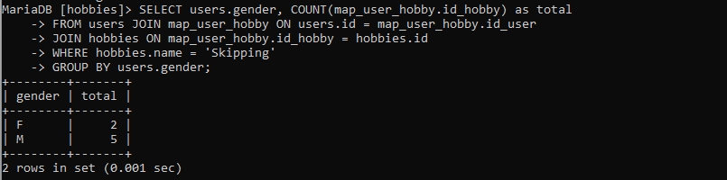
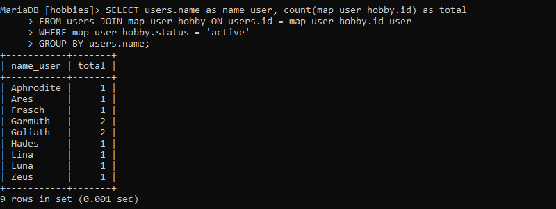
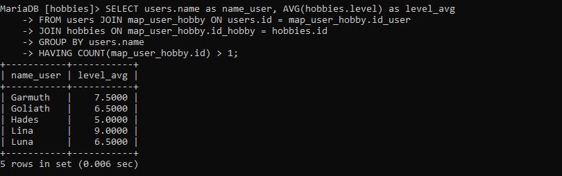

# BACKEND TEST
## Requirements
- mysql
## Running The Code
Buat sebuah database kosong.
```bash
CREATE DATABASE <dbname>
```

Import database.
```bash
msyql -u <username> -p <dbname> < hobbies.sql
```

Ganti username dengan username anda, serta dbname sesuai database yang dibuat. \
Setelah database diimport, database sudah bisa digunakan. 

## Usage
Untuk mengecek query 1, masukkan query berikut. Ganti hobi sesuai dengan keinginan hobi yang dicari.
### Query 1
```bash
SELECT users.gender, COUNT(map_user_hobby.id_hobby) as total
FROM users JOIN map_user_hobby ON users.id = map_user_hobby.id_user 
JOIN hobbies ON map_user_hobby.id_hobby = hobbies.id 
WHERE hobbies.name = 'Skipping' 
GROUP BY users.gender;
```
#### Hasil :


### Query 2
```bash
SELECT users.name as name_user, count(map_user_hobby.id) as total
FROM users JOIN map_user_hobby ON users.id = map_user_hobby.id_user
WHERE map_user_hobby.status = 'active'
GROUP BY users.name;
```
#### Hasil :


### Query 3
```bash
SELECT users.name as name_user, AVG(hobbies.level) as level_avg
FROM users JOIN map_user_hobby ON users.id = map_user_hobby.id_user
JOIN hobbies ON map_user_hobby.id_hobby = hobbies.id 
GROUP BY users.name
HAVING COUNT(map_user_hobby.id) > 1;
```
#### Hasil :


## Author
[Ilham Prasetyo Wibowo](mailto:ilhamprasetyowb@gmail.com?)