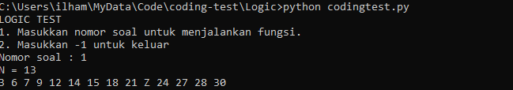
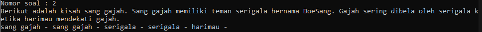
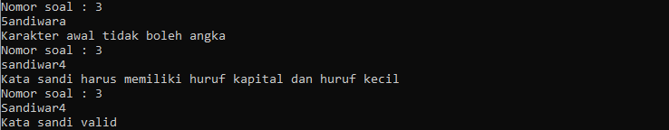
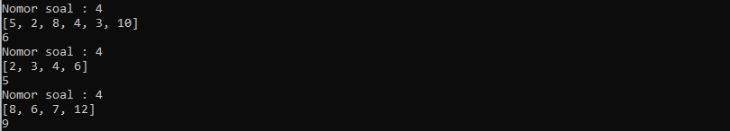
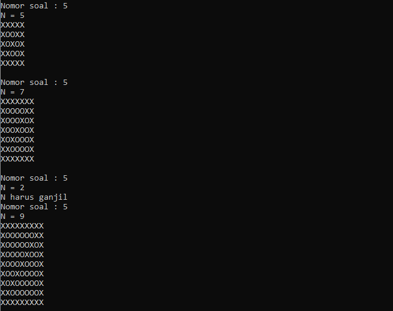

# LOGIC TEST
## Requirements

Untuk menjalankan program, diperlukan
- Python https://www.python.org/


## Running The Code

```bash
python codingtest.py
```
## Usage
Ketika program berhasil dijalankan, program akan meminta input nomor soal.

Setelah itu masukkan nomor soal yang diinginkan.
- 1

- 2

- 3

- 4

- 5


## Author
Ilham Prasetyo Wibowo

