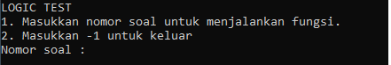

# LOGIC TEST
## Requirements

Untuk menjalankan program, diperlukan
- Python https://www.python.org/


## Running The Code

```bash
python codingtest.py
```
## Usage
Ketika program berhasil dijalankan, program akan meminta input nomor soal. \
 \
Setelah itu masukkan nomor soal yang diinginkan.
#### Nomor 1

#### Nomor 2

#### Nomor 3

#### Nomor 4

#### Nomor 5


## Author

[Ilham Prasetyo Wibowo](mailto:ilhamprasetyowb@gmail.com?)

